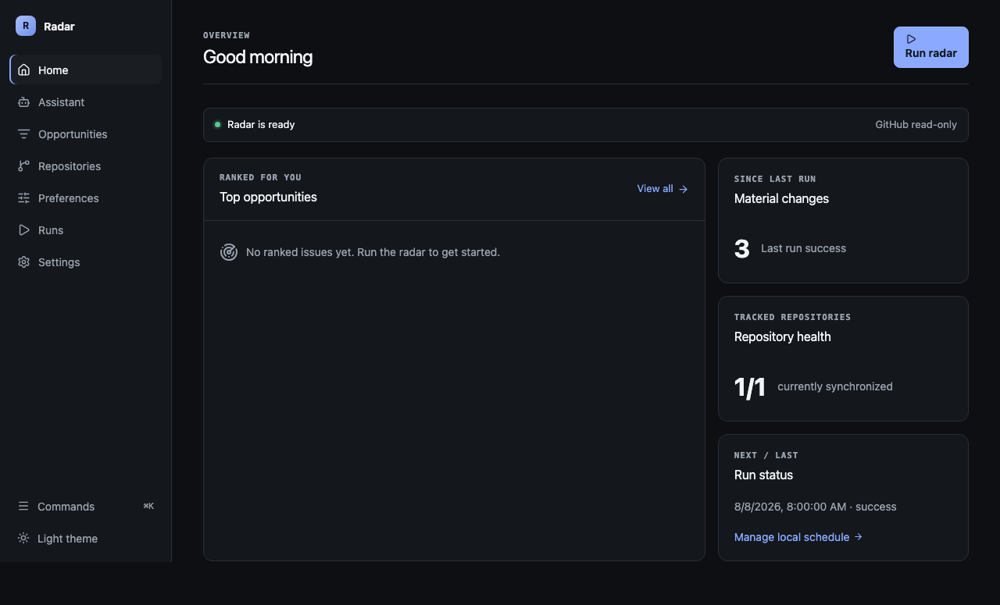

# Web UI screenshots

The release screenshot is generated from the production React build with deterministic
mock API data after the accessibility and E2E gates pass.

It demonstrates the minimal dark application shell, ranked issues, materially changed issue
summary, tracked-repository health, and current run state. Do not use screenshots as a data
contract; the versioned API/resource contracts remain authoritative.
